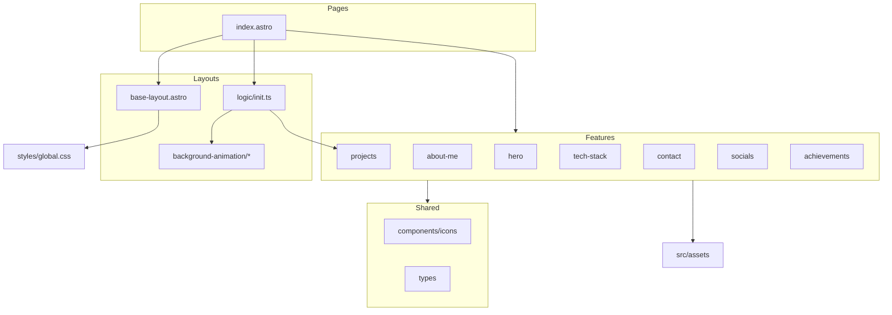
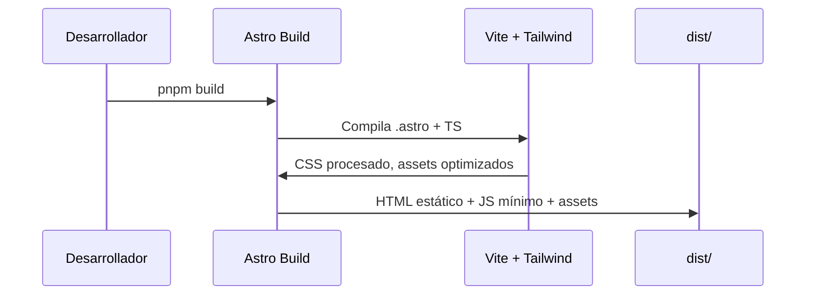

# Arquitectura del proyecto

Portfolio personal de **Martín Viera** construido con [Astro 6](https://docs.astro.build). Es una aplicación de una sola página (SPA estática) orientada a rendimiento, accesibilidad y mantenibilidad mediante una organización por **features**.

---

## Resumen

| Aspecto | Detalle |
|--------|---------|
| **Framework** | Astro 6 (SSG — Static Site Generation) |
| **Estilos** | Tailwind CSS v4 (`@tailwindcss/vite`) |
| **Lenguaje** | TypeScript (modo estricto) |
| **Runtime** | Node.js 22.x |
| **Gestor de paquetes** | pnpm |
| **Sitio de producción** | `https://martinviera.dev` |
| **Formulario de contacto** | Formspree (envío externo) |

El sitio se compone de una única ruta (`/`) que renderiza todas las secciones del portfolio dentro de un layout base con animación de fondo en canvas.

---

## Estructura de directorios

```text
portfolio_v2/
├── docs/                          # Documentación del proyecto
├── public/                        # Assets estáticos servidos tal cual
│   ├── cv/                        # CV descargable (PDF)
│   ├── images/                    # Imágenes OG y recursos públicos
│   └── favicon.*
├── src/
│   ├── assets/                    # Assets procesados por Astro (imágenes, fuentes)
│   │   ├── fonts/
│   │   └── images/
│   ├── features/                  # Módulos de dominio (secciones del portfolio)
│   ├── layouts/                   # Layouts, constantes y lógica de shell
│   ├── pages/                     # Rutas de Astro (file-based routing)
│   ├── shared/                    # Código reutilizable entre features
│   │   ├── components/icons/      # Iconos SVG como componentes Astro
│   │   └── types/                 # Tipos compartidos
│   └── styles/
│       └── global.css             # Design tokens, base y utilidades globales
├── astro.config.mjs               # Configuración de Astro, fuentes y Vite
├── tsconfig.json                  # Alias `@/*` → `src/*`
├── eslint.config.js               # Linting (Astro + a11y)
└── package.json
```

---

## Diagrama de capas



---

## Capas de la aplicación

### 1. Pages (`src/pages/`)

Astro usa **file-based routing**: cada archivo en `pages/` se convierte en una ruta.

- **`index.astro`**: punto de entrada único. Importa `BaseLayout`, compone todas las features y define el grid responsivo del `<main>`. Al final del archivo, un `<script>` cliente invoca `initClient()` para activar la lógica interactiva.

### 2. Layouts (`src/layouts/`)

Responsables del **shell HTML** compartido por todas las páginas.

| Archivo | Responsabilidad |
|---------|-----------------|
| `base-layout.astro` | `<html>`, meta SEO, Open Graph, Twitter Cards, JSON-LD, fuentes preload, canvas de fondo |
| `constants.ts` | Valores por defecto de SEO y configuración del grid animado |
| `types.ts` | Tipos del layout (`SoftGridConfig`) |
| `logic/init.ts` | Punto único de inicialización del cliente |
| `logic/background-animation/` | Animación del grid de fondo en `<canvas>` |

El layout expone props opcionales (`title`, `description`, `image`, `grid`, `speedX`, `speedY`) y usa `data-*` attributes en `<body>` para configurar la animación sin acoplar JavaScript al template.

### 3. Features (`src/features/`)

Cada sección del portfolio es un **módulo autocontenido** siguiendo el mismo patrón:

```text
features/<nombre>/
├── <nombre>.astro      # Componente de presentación (UI)
├── data.ts               # Datos estáticos del dominio
├── types.ts              # Interfaces TypeScript
├── components/           # Sub-componentes (opcional, ej. projects)
└── logic/                # Lógica cliente (opcional, ej. slider)
```

**Features actuales:**

| Feature | Descripción |
|---------|-------------|
| `hero` | Presentación: foto, nombre y rol |
| `about-me` | Lista de valores/enfoque con iconos |
| `projects` | Carrusel de proyectos destacados |
| `tech-stack` | Tecnologías core (iconos) y herramientas (texto) |
| `contact` | Sección "Let's Talk" + modal de formulario |
| `socials` | Enlaces a redes sociales |
| `achievements` | Tarjetas de logros |

El barrel file `features/index.ts` reexporta todos los componentes para que `index.astro` importe desde un único punto:

```ts
import { Hero, Projects, ... } from "@/features";
```

#### Patrón data + types

Los datos se definen en `data.ts` con `as const satisfies Tipo`, lo que garantiza:

- Inmutabilidad en tiempo de compilación
- Validación de tipos sin perder inferencia literal
- Separación clara entre **contenido** y **presentación**

Las imágenes de features viven en `src/assets/` y se importan como `ImageMetadata` de Astro para optimización automática en build.

### 4. Shared (`src/shared/`)

Código transversal que no pertenece a un dominio concreto.

- **`components/icons/`**: iconos SVG como componentes `.astro`, agrupados en `ui/`, `social/` y `tech/`. Cada carpeta expone un `index.ts` barrel.
- **`types/with-icon.ts`**: contrato `WithIcon` (`Icon: IconComponent`) usado por features que renderizan iconos desde datos.

---

## Sistema de diseño

### Tailwind CSS v4

Los estilos globales viven en `src/styles/global.css`:

1. **`@theme`**: design tokens (colores, breakpoints, superficies, tipografía)
2. **`@layer base`**: tipografía base (`body`, `h1`–`h3`)
3. **Utilidades de componente**: `.card`, bordes, sombras, estilos de `dialog`

Paleta principal: grises oscuros (`modern-gray-*`) con acento verde lima (`power` / `--color-accent`).

### Fuentes

Configuradas en `astro.config.mjs` con `fontProviders.local()` y variables CSS (`--font-SpaceGrotesk`, `--font-JetBrainsMono`, etc.). El layout precarga las fuentes críticas con `<Font preload />`.

### Grid responsivo de la página

`index.astro` define un CSS Grid que reposiciona las secciones según breakpoint:

| Breakpoint | Comportamiento |
|------------|----------------|
| Mobile (`max-md`) | Columna única, flujo vertical |
| `md` | Grid 2 columnas, filas fijas de `2rem` |
| `xl` | Grid 3 columnas |
| `3xl` (112.5rem) | Grid 5 columnas — layout de escritorio amplio |

Cada feature declara su posición en el grid con clases Tailwind (`md:row-span-*`, `xl:col-start-*`, etc.) directamente en su componente.

---

## Lógica del cliente

Astro genera HTML estático; la interactividad se añade con **scripts del lado del cliente** sin frameworks de UI.

### Inicialización (`layouts/logic/init.ts`)

```ts
export const initClient = (): void => {
  projectsSlider();
  bodyGridAnimation();
};
```

Funciones idempotentes que se ejecutan una vez al cargar la página.

### Animación de fondo (`background-animation/`)

- Lee configuración desde `data-soft-grid`, `data-grid`, `data-speed-x`, `data-speed-y` en `<body>`
- Dibuja un grid en `<canvas>` con `requestAnimationFrame`
- Respeta `prefers-reduced-motion`: detiene la animación y muestra un grid estático
- Usa `ResizeObserver` y `devicePixelRatio` para nitidez en pantallas retina
- Registra instancias en un `Map` para evitar duplicados

### Slider de proyectos (`features/projects/logic/slider.ts`)

- En viewports menores a `3xl`: carrusel controlado por radio buttons (CSS `:has()` para el track)
- En `3xl+`: muestra todos los proyectos; el script desactiva `inert` y `aria-hidden`
- Sincroniza atributos de accesibilidad (`aria-current`, `aria-label`, foco atrapado)

### Modal de contacto

Usa el elemento nativo `<dialog>` con los atributos `command` / `commandfor` (HTML Invoker Commands) para abrir y cerrar sin JavaScript adicional. El formulario envía a **Formspree** vía `POST`.

---

## Assets

| Ubicación | Uso |
|-----------|-----|
| `src/assets/images/` | Imágenes optimizadas con `<Image>` de `astro:assets` |
| `src/assets/fonts/` | Fuentes locales referenciadas en `astro.config.mjs` |
| `public/` | Archivos servidos sin procesar: favicons, OG image, CV PDF |

**Regla práctica:** imágenes que necesitan optimización → `src/assets/`. Archivos que deben tener URL fija o descarga directa → `public/`.

---

## SEO y metadatos

`base-layout.astro` centraliza:

- `<title>`, `<meta name="description">`, canonical URL
- Open Graph y Twitter Cards
- JSON-LD (`Person` + `WebSite`) para datos estructurados
- Skip link (`#main-content`) para accesibilidad

Los defaults viven en `layouts/constants.ts` (`SEO_DEFAULTS`) y pueden sobrescribirse por página vía props del layout.

---

## Alias y TypeScript

```json
{
  "paths": {
    "@/*": ["src/*"]
  }
}
```

Permite imports como `@/features`, `@/layouts/base-layout.astro`, `@/shared/components/icons/ui`.

El proyecto extiende `astro/tsconfigs/strict` para máxima seguridad de tipos.

---

## Tooling

| Herramienta | Propósito |
|-------------|-----------|
| `pnpm dev` | Servidor de desarrollo (puerto 4321) |
| `pnpm build` | Genera sitio estático en `dist/` |
| `pnpm preview` | Previsualiza el build de producción |
| `pnpm lint` | ESLint con `eslint-plugin-astro` y `jsx-a11y` |
| `sharp` | Procesamiento de imágenes en build |

---

## Flujo de build



1. Astro compila cada `.astro` a HTML en build time
2. Las imágenes de `src/assets/` se optimizan (formato, tamaños responsivos)
3. Tailwind purga clases no usadas
4. Los `<script>` de cliente se empaquetan como módulos ES ligeros
5. El resultado es HTML/CSS/JS estático desplegable en cualquier CDN

---

## Accesibilidad

Prácticas integradas en la arquitectura:

- Landmarks semánticos (`<main>`, `<nav>`, `<section>`, `role="banner"`)
- Textos alternativos en imágenes y `sr-only` donde corresponde
- Carrusel con `aria-roledescription`, `inert` y gestión de foco
- `prefers-reduced-motion` en CSS global y en la animación del canvas
- `:focus-visible` con outline de acento en enlaces y botones
- Formulario con labels asociados y campos `required`

---

## Convenciones para extender el proyecto

### Añadir una nueva sección

1. Crear carpeta en `src/features/<nombre>/`
2. Definir `types.ts` y `data.ts`
3. Crear `<nombre>.astro` con posicionamiento en el grid
4. Exportar desde `features/index.ts`
5. Importar y colocar en `pages/index.astro`

### Añadir un icono

1. Crear `src/shared/components/icons/<grupo>/<nombre>-ico.astro`
2. Exportar desde el `index.ts` del grupo
3. Referenciar en `data.ts` de la feature

### Añadir lógica cliente

1. Crear `features/<nombre>/logic/<función>.ts` o añadir en `layouts/logic/`
2. Registrar la llamada en `layouts/logic/init.ts`
3. Usar `data-*` attributes para conectar DOM y lógica sin selectores frágiles

### Añadir una nueva página

1. Crear archivo en `src/pages/` (ej. `thanks.astro` para post-envío del formulario)
2. Envolver con `BaseLayout` y personalizar props SEO si hace falta

---

## Decisiones arquitectónicas

| Decisión | Motivación |
|----------|------------|
| **Feature-based folders** | Cada sección es independiente; facilita editar contenido sin tocar otras áreas |
| **SSG con Astro** | Portfolio estático: máximo rendimiento, mínimo JS en el cliente |
| **Sin framework de UI** | El sitio es mayormente presentacional; Astro + Tailwind cubren el caso sin overhead de React/Vue |
| **Data en TypeScript** | Tipado y validación en compile-time; no hay CMS ni API |
| **Init centralizado** | Un solo punto de entrada cliente evita scripts dispersos y duplicados |
| **Canvas para el fondo** | Animación performante desacoplada del DOM; configurable vía data attributes |
| **Formspree** | Backend de formularios sin servidor propio |

---

## Referencias internas clave

| Archivo | Rol |
|---------|-----|
| `src/pages/index.astro` | Composición de la página |
| `src/layouts/base-layout.astro` | Shell HTML, SEO, canvas |
| `src/features/index.ts` | API pública de features |
| `src/layouts/logic/init.ts` | Bootstrap del cliente |
| `src/styles/global.css` | Design system |
| `astro.config.mjs` | Fuentes, alias Vite, URL del sitio |
